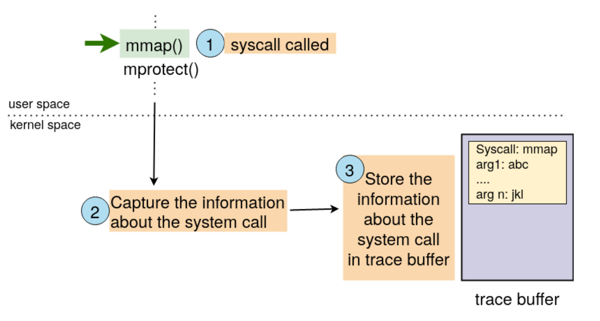
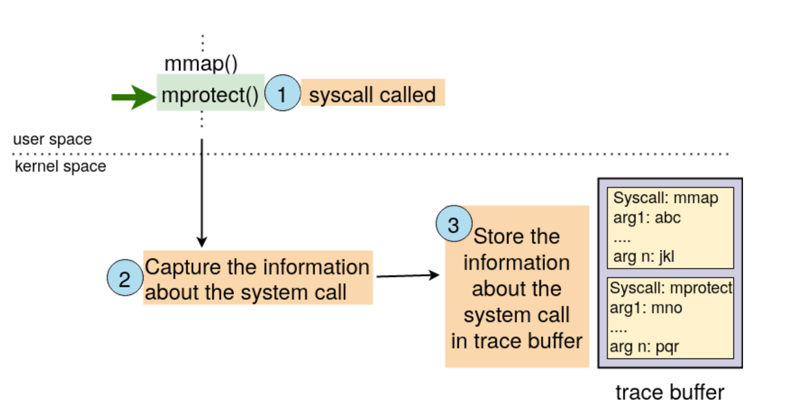
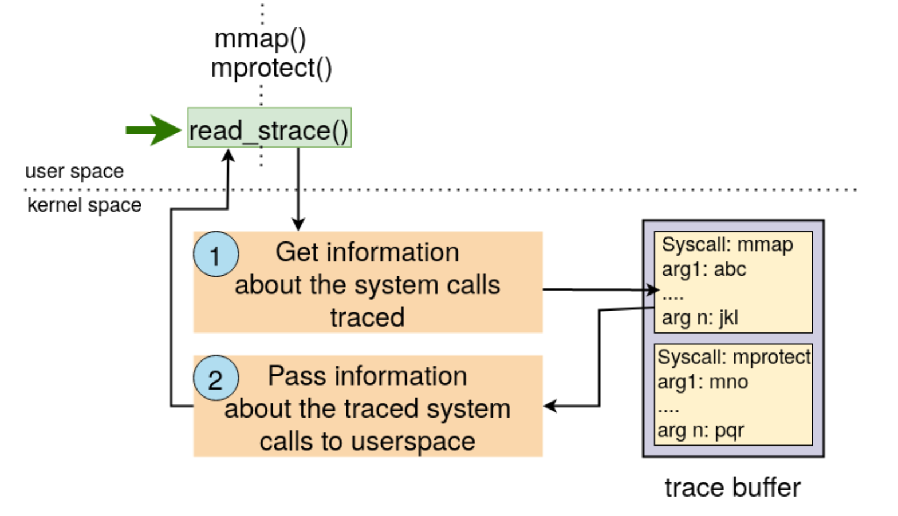

# Tracer
# GemOS Docker Instance Setup

## 1. Installation

Install Docker on your system by following the instructions for your operating system:

- [Ubuntu Installation](https://docs.docker.com/engine/install/ubuntu/)
- [Mac Installation](https://docs.docker.com/docker-for-mac/install/)
- [Windows Installation](https://docs.docker.com/docker-for-windows/install/)

## 2. Download Docker Image

Download the GemOS Docker image from the following link:
[cs330-gemos.tar.gz](https://cse.iitk.ac.in/users/deba/cs330/cs330-gemos.tar.gz)

## 3. Steps to Create the Docker Container on Unix/Linux

Run the following commands in the terminal (use `sudo` in Linux machines):

```bash
$ docker import cs330-gemos.tar.gz
$ docker image ls  # It will show the newly created image; get its ID (say <image-id>)
$ docker image tag <image-id> cs330
$ docker run -it -p 2020:22 <image-id> /bin/bash  # This should take you to a shell

# In another terminal, type the following command (and exit the shell)
$ docker ps  # Note down container ID using command "docker ps" (say <container-id>)
$ docker container rename <container-id> NameYouWantToUse
```
4. Using the Docker Container

Run the following commands in the terminal:
```bash
$ docker start NameYouWantToUse  # Starts the container
$ ssh -p 2020 osws@localhost  # Should take you to ssh prompt; use password ’cs330’
$ docker stop NameYouWantToUse  # Stops the container
```
Check `docker --help` for more Docker commands.

5. Executing GemOS

Start the container and login. After login, run the following commands in the Docker container terminal:

```bash
$ cd gem5
$ ./run.sh /home/osws/gemOS/src/gemOS.kernel
```
Open another terminal and ssh to the container, then run the following command:
```bash
$ telnet localhost 3456  # Will show you the GemOS console
```
Feel free to explore more about GemOS and its functionalities.

Note: Make sure to replace placeholders such as `<image-id>` and `<container-id>` with the actual values obtained during the setup.


# Directory Structure

The `gemOS` source code is organized in the following directory structure:

- **gemOS/src/user/:** Contains user space components of gemOS.
  - `init.c`: Userspace program that interacts with gemOS using system calls.
  - `lib.c`: Library with the implementation of common functions like `printf()` (equivalent to libc in Linux, not to be modified).
  - `ulib.h`: Header file with declarations of various functions and system calls (equivalent to user space header files in Linux, not to be modified).

- **gemOS/src/include/:** Contains header files related to the kernel space implementation of gemOS. (Modify only the specified files)

- **gemOS/src/*.c, *.o files:** Implementation of the kernel space of gemOS. (Modify only the specified files)

- **gemOS/src/Makefile:** Used to build the gemOS kernel binary `gemOS.kernel`. (Not to be modified)

## Assignment Details

As part of the assignment, the task involves implementing system calls in the teaching OS (gemOS). The source code is available in the `gemOS/src` directory.

### User Space Components

- **init.c:** Userspace program that runs on gemOS. This program interacts with gemOS using system calls.

- **lib.c:** Library containing the implementation of common functions such as `printf()` (equivalent to libc in Linux, not to be modified).

- **ulib.h:** Header file with declarations of various functions and system calls (equivalent to user space header files in Linux, not to be modified).

### Kernel Space Implementation

Modify only the specified files in the `gemOS/src` directory related to the kernel space implementation.

### Building gemOS Kernel

Use the provided `gemOS/src/Makefile` to build the gemOS kernel binary `gemOS.kernel`. Do not modify the Makefile.

Feel free to refer to the specific files for detailed implementation instructions.

# Trace Buffer Operations

A trace buffer is a unidirectional data channel with a single file descriptor for reading and writing. Key specifications include:

- Trace buffer size: 4096 bytes
- Read offset (R) and write offset (W) signify positions in the buffer for future read/write requests.

## Example Operations

1. Init process creates an empty trace buffer (4096 bytes).

2. `init` calls `write(2000)`, filling the buffer from offset 0 to 1999. W = 2000, R = 0.

3. `init` calls `read(1000)`, reading from offset 0 to 999. R = 1000.

4. Subsequent reads start from offset 1000 onwards; data before this offset is inaccessible.

5. `init` calls `write(2496)`, writing 2096 bytes from offset 2000 to 4095 and 400 bytes from 0 to 399. W = 400.

6. `init` calls `read(3296)`, reading 3096 bytes from offset 1000 to 4095 and 200 bytes from 0 to 199. R = 200.

7. Max data readable by `init`: 3496 bytes (offset 1000 to 4095, then offset 0 to 399).


# Implementation of Trace Buffer Functionality in gemOS

## Process Control Block and File Descriptors

The process control block is represented by the `exec_context` structure in gemOS. It contains an array of file descriptors, where each file descriptor is of type `struct file`. Each file descriptor may point to a file object (represented by the `struct file`) if it's in use, or it may point to NULL to signify an unused file descriptor.

Example usage within `exec_context`:

```c
struct exec_context {
    // Other fields...
    struct file* files[MAX_OPEN_FILES]; /*To keep a record of open files */
    // Other fields...
};
```
##File Object Structure

A file object is represented by `struct file` and is defined in `gemOS/src/include/file.h`. It includes relevant information such as type, mode, offset, reference count, inode, trace buffer information, and function pointers through `struct fileops` for read, write, lseek, and close operations.

```c
struct file {
    u32 type;
    u32 mode;
    u32 offp;
    u32 ref_count;
    struct inode * inode;
    struct trace_buffer_info * trace_buffer;
    struct fileops * fops; // Function pointers for file operations
};
```
#File Operations Structure

The `struct fileops` in `gemOS/src/include/file.h` contains function pointers for read, write, lseek, and close operations. You are required to provide implementations for these function pointers in the provided function templates.

```c
struct fileops {
    int (*read)(struct file *filep, char *buff, u32 count);
    int (*write)(struct file *filep, char *buff, u32 count);
    long (*lseek)(struct file *filep, long offset, int whence);
    long (*close)(struct file *filep);
};
```
##Trace Buffer Information Structure

Modify `struct trace_buffer_info` in `gemOS/src/include/tracer.h` as needed to implement the trace buffer functionality.

```c
struct trace_buffer_info {
    // Add members needed for trace buffer functionality
};
```
##Memory Allocation and Deallocation

Use the provided memory allocation and deallocation functions:

- `void *os_alloc(u32 size)`: Allocates a memory region of size bytes (limited to 2048 bytes).
- `void *os_page_alloc(memory_region)`: Allocates a 4KB page from a specified memory region.
Example usage:
```c
struct vm_area *vm = (struct vm_area*)os_alloc(sizeof(struct vm_area));
struct file *filep = (struct file*)os_page_alloc(USER_REG);
```
- `void os_free(void *ptr_to_free, u32 size)`: Frees memory allocated using os_alloc.
- `void os_page_free(memory_region, void *ptr_to_free)`: Frees memory allocated using os_page_alloc.
Example usage:
```c
os_free(vm, sizeof(struct vm_area));
os_page_free(USER_REG, filep);
```
Remember to refer to the specific files mentioned for detailed implementations.

# gemOS Data Structures

## `exec_context` Structure

The `exec_context` structure, defined in `gemOS/src/include/context.h`, stores information about the memory regions belonging to a process. It consists of the following key components:
```c
struct exec_context {
    ...
    struct mm_segment mms[MAX_MM_SEGS];
    struct vm_area *vm_area;
    ...
};
```
`mms`: An array of memory segments representing contiguous segments in a process. gemOS supports various memory segments, which are described by the following enum:
```c
enum {
    MM_SEG_CODE,    // Code segment
    MM_SEG_RODATA,  // Read-only data segment
    MM_SEG_DATA,    // Data segment
    MM_SEG_STACK,   // Stack segment
    MAX_MM_SEGS      // Total number of segments
};
```
`vm_area`: A linked list of memory regions allocated using `mmap()` for dis-contiguous mapping.
##mm_segment Structure

The `mm_segment` structure, also defined in `gemOS/src/include/context.h`, represents a memory segment:
```c
struct mm_segment {
    unsigned long start;      // Start address of the memory segment
    unsigned long end;        // End address
    unsigned long next_free;  // Valid up to
    u32 access_flags;         // Access flags. R=1, W=2, X=4
};
```
## `vm_area` Structure

The `vm_area` structure, defined in `gemOS/src/include/context.h`, represents a virtual memory area:
```c
struct vm_area {
    unsigned long vm_start;   // Start address of the vm_area
    unsigned long vm_end;     // End address
    u32 access_flags;         // Access flags. R=1, W=2, X=4
    struct vm_area *vm_next;  // Pointer to the next vm_area
};
```
# Implementing System Call Tracing Functionality in gemOS

In gemOS, we introduce system call tracing functionality similar to the strace utility in Linux. This feature allows the interception and recording of system calls invoked by a process.

## Working

If system call tracing is enabled for a process, gemOS captures two key pieces of information for each invoked system call:
1. System call number.
2. Values of each argument for the system call.

The captured information is stored in a configured trace buffer. The user space can then consume this information by invoking the `read_strace` system call.




In Figure 1, the `mmap()` system call is invoked, and information about this system call is saved in the trace buffer.




Following the `mmap()` system call, Figure 2 illustrates the invocation of the `mprotect()` system call, and its information is stored in the trace buffer.




When a special system call, `read_strace()`, is called from the user space process (Figure 3), information captured about the traced system calls (stored in the trace buffer) is passed back to the user space. The working of the trace buffer remains consistent with the description in §1. For instance, read/write offsets of the trace buffer should be modified as required when information about the traced system calls is stored or consumed.
